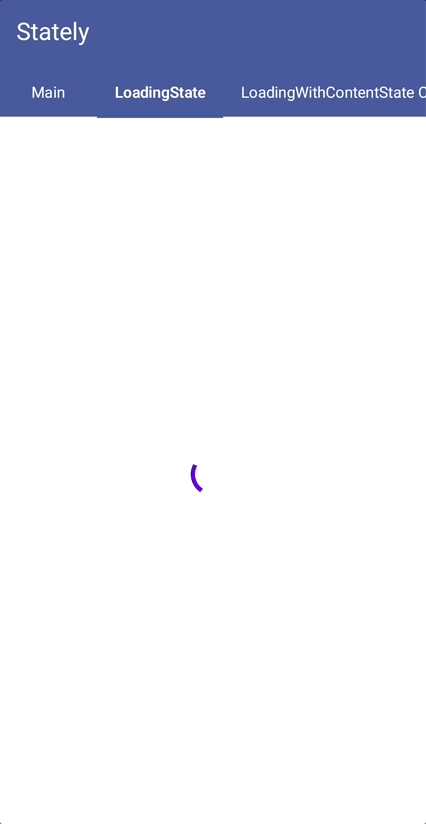
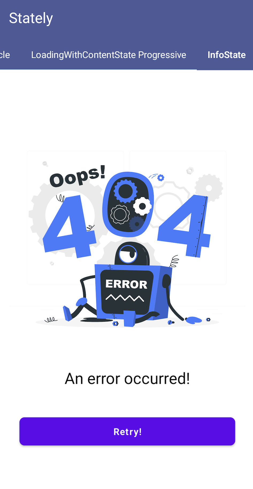

# Stately

Stately is a library for managing different states of a content in Jetpack Compose.

|  |  |  |  |  |
| ------------------------------------- | ---------------------------------------- | --------------------------------------------------------- | ----------------------------------------------------------- | --------------------------------------------------------- |

## Usage

To use the code, first create an `LayoutState` instance with using `rememberContentState`. Then, use the `content parameter of layout state` to customize state.

```kotlin
val contentState = rememberContentState()

LaunchedEffect(Unit) {
  contentState.content = /* new state */
}
```

You can fill contentLayout, infoLayout, loadingLayout as you like.

```kotlin
Stately(
    modifier = Modifier.fillMaxSize(),
    layoutState = contentState,
    infoLayout = { model ->
        InfoState(
            modifier = Modifier.fillMaxSize(),
            model = model,
            retryButtonClicked = onRetryButtonClick
        )
    },
    loadingLayout = {
        LoadingState()
    },
    contentLayout = {
        Column(
            modifier = Modifier.fillMaxSize(),
            verticalArrangement = Arrangement.Center,
            horizontalAlignment = Alignment.CenterHorizontally
        ) {
            SampleContent(modifier = Modifier.padding(8.dp))
        }
    },
)

```

##### Installation

## Including in your project

1. Add the JitPack repository to your project-level `build.gradle` file:

```
allprojects {
    repositories {
        ...
        maven { url 'https://jitpack.io' }
    }
}
```

1. Add the dependency to your app-level `build.gradle` file:

```
dependencies {
    implementation 'com.github.trendyol:stately:1.0.0'
}
```

1. Sync your project with Gradle files.

## License

This project is licensed under the Apache License, Version 2.0 - see the LICENSE file for details.